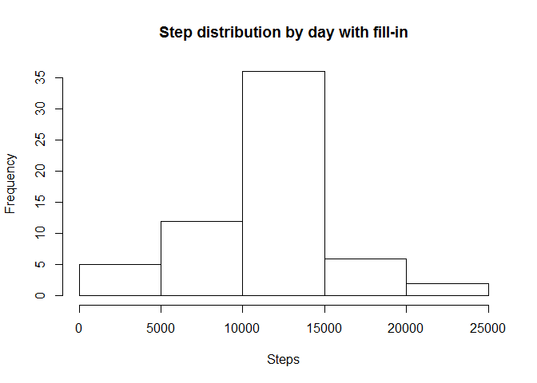

# Reproducible Research: Peer Assessment 1


## Loading and preprocessing the data


```r
library(dplyr)
```

```
## 
## Attaching package: 'dplyr'
```

```
## The following objects are masked from 'package:stats':
## 
##     filter, lag
```

```
## The following objects are masked from 'package:base':
## 
##     intersect, setdiff, setequal, union
```

```r
# 1. Load the data (i.e. read.csv())
if(!file.exists("activity.csv")) unzip("activity.zip")
activity_by_time <- tbl_df(read.csv("activity.csv", 
                       header = TRUE, 
                       na.strings = "NA"))
# 2. Process/transform the data (if necessary) into a format suitable for your analysis
activity_by_day <- activity_by_time %>%
        na.omit() %>%
        group_by(date) %>%
        summarise(steps = sum(steps))
```

## What is mean total number of steps taken per day?

```r
# 1. Make a histogram of the total number of steps taken each day
hist(activity_by_day$steps, xlab = "Steps", main = "Step distribution by day")
```


```r
# 2. Calculate and report the mean and median total number of steps taken per day
avg_steps_taken_per_day <- mean(activity_by_day$steps, na.rm = TRUE)
avg_steps_taken_per_day
```

```
## [1] 10766.19
```

```r
median_steps_taken_per_day <- median(activity_by_day$steps, na.rm = TRUE)
median_steps_taken_per_day
```

```
## [1] 10765
```
## What is the average daily activity pattern?

```r
# 1. Make a time series plot (i.e. type = "l") of the 5-minute interval (x-axis) and the average number of steps taken, averaged across all days (y-axis)
mean_steps_by_interval <- activity_by_time %>%
        na.omit() %>%
        group_by(interval) %>%
        summarise(mean_steps = mean(steps))
plot(mean_steps~interval, data = mean_steps_by_interval, type = "l")
```


```r
# 2. Which 5-minute interval, on average across all the days in the dataset, contains the maximum number of steps?
mean_steps_by_interval$interval[which.max(mean_steps_by_interval$mean_steps)]
```

```
## [1] 835
```

## Imputing missing values

```r
# 1. Calculate and report the total number of missing values in the dataset (i.e. the total number of rows with NAs)
sum(is.na(activity_by_time$steps))
```

```
## [1] 2304
```

```r
# 2. Devise a strategy for filling in all of the missing values in the dataset. The strategy does not need to be sophisticated. For example, you could use the mean/median for that day, or the mean for that 5-minute interval, etc.
# 3. Create a new dataset that is equal to the original dataset but with the missing data filled in.
filled_activity_by_time <- activity_by_time <- activity_by_time %>%
        group_by(date) %>%
        mutate(steps = replace(steps, is.na(steps), mean_steps_by_interval$mean_steps[is.na(steps)]))

# 4. Make a histogram of the total number of steps taken each day and Calculate and report the mean and median total number of steps taken per day.
activity_by_day_with_fill <- filled_activity_by_time %>%
        group_by(date) %>%
        summarise(steps = sum(steps))
hist(activity_by_day_with_fill$steps, xlab = "Steps", main = "Step distribution by day with fill-in")
```



```r
avg_steps_taken_per_day_with_fill <- mean(activity_by_day_with_fill$steps)
avg_steps_taken_per_day_with_fill
```

```
## [1] 10766.19
```

```r
median_steps_taken_per_day_with_fill <- median(activity_by_day_with_fill$steps)
median_steps_taken_per_day_with_fill
```

```
## [1] 10766.19
```

```r
#  Do these values differ from the estimates from the first part of the assignment? What is the impact of imputing missing data on the estimates of the total daily number of steps?
avg_change_pct <- (avg_steps_taken_per_day_with_fill - avg_steps_taken_per_day) / avg_steps_taken_per_day * 100
avg_change_pct
```

```
## [1] 0
```

```r
mean_change_pct <- (median_steps_taken_per_day_with_fill - median_steps_taken_per_day)/median_steps_taken_per_day * 100
mean_change_pct
```

```
## [1] 0.01104207
```

```r
sprintf("Mean value is changed by %f%%", avg_change_pct)
```

```
## [1] "Mean value is changed by 0.000000%"
```

```r
sprintf("Median value is changed by %f%%", mean_change_pct)
```

```
## [1] "Median value is changed by 0.011042%"
```
We can see that mean value is not affected, but median value increases a little by replacing missing values.

## Are there differences in activity patterns between weekdays and weekends?

```r
library(timeDate) # install https://cran.r-project.org/web/packages/timeDate/index.html
library(lattice)
# 1. Create a new factor variable in the dataset with two levels -- "weekday" and "weekend" indicating whether a given date is a weekday or weekend day.
days_of_week_pattern <- filled_activity_by_time %>%
        mutate(days_of_week = ifelse(isWeekday(date), "weekdays", "weekends")) %>%
        group_by(days_of_week, interval) %>%
        summarise(mean_steps = mean(steps))

# 2. Make a panel plot containing a time series plot (i.e. type = "l") of the 5-minute interval (x-axis) and the average number of steps taken, averaged across all weekday days or weekend days (y-axis).
with(days_of_week_pattern, xyplot(mean_steps~interval|days_of_week, 
                     ylab="Number of steps", 
                     xlab="Interval", 
                     type = "l", 
                     layout = c(1,2)))
```


